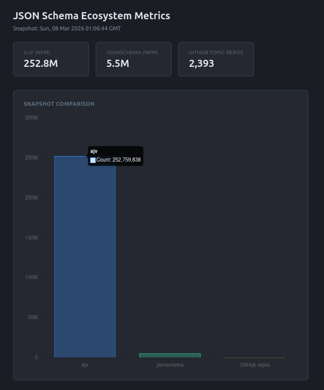

# JSON Schema Ecosystem Observability

A small CLI that collects metrics about the JSON Schema ecosystem and writes them to structured JSON. Built for the GSoC 2026 Ecosystem Observability qualification task.

## Prerequisites

- Node.js 18+

## Install and run

```bash
npm install
npm start
```

Output is written to `output/metrics.json` (latest snapshot) and `output/history.jsonl` (last 52 runs, one JSON object per line).

## Viewing the chart

Serve the project root, then open the dashboard in a browser:

```bash
npm run serve
```

Then open `http://localhost:3000/visualization/chart.html` (or the URL printed by the script). Root `/` redirects to the chart. Port can be overridden with `PORT=8080 npm run serve`.

Alternatively: `npx serve` or `python3 -m http.server 8080`, then open the same path under the port shown.

Opening the HTML file directly via `file://` will fail to load the JSON because of CORS.

## APIs used

- **npm:** `https://api.npmjs.org/downloads/point/last-week/<package>` — no auth.
- **GitHub:** `https://api.github.com/search/repositories?q=topic:json-schema` — optional `GITHUB_TOKEN` for higher rate limits (unauthenticated is limited).

Set `GITHUB_TOKEN` in the environment if you hit GitHub rate limits.

## Example output

```json
{
  "timestamp": "2026-03-08T12:00:00.000Z",
  "metrics": [
    { "name": "ajv_weekly_downloads", "value": 243000000, "source": "npm", "description": "Weekly download count for the ajv JSON Schema validator" },
    { "name": "jsonschema_weekly_downloads", "value": 5300000, "source": "npm", "description": "Weekly download count for the jsonschema package" },
    { "name": "github_json_schema_topic_repos", "value": 2377, "source": "github", "description": "Number of public GitHub repositories tagged with the json-schema topic" }
  ]
}
```

Weekly runs append one line to `output/history.jsonl`; the file is trimmed to the last 52 entries.
